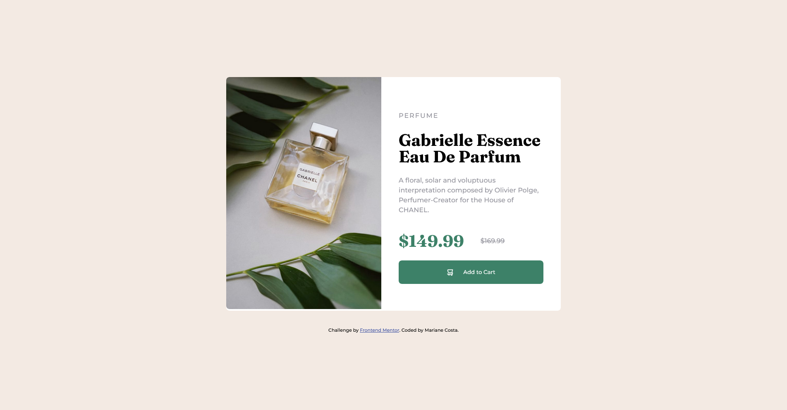
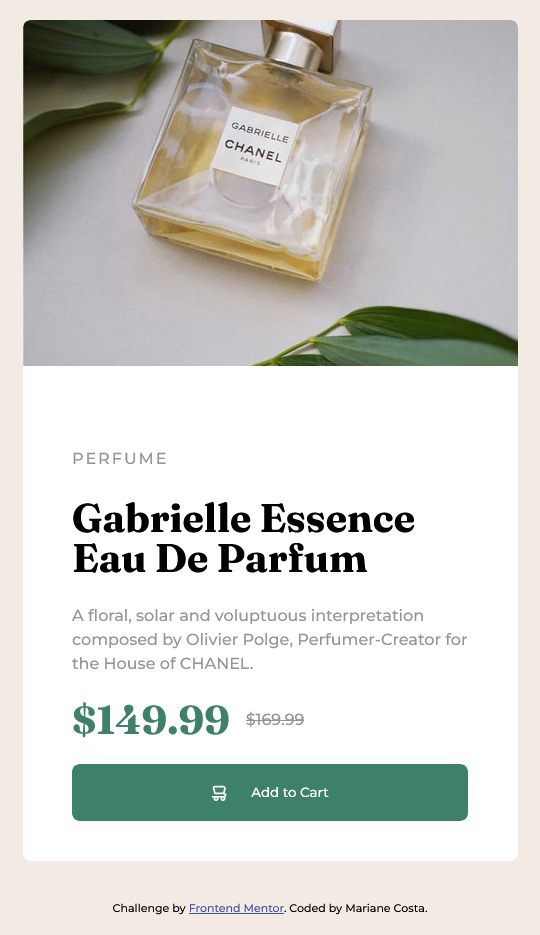

# Frontend Mentor - Product preview card component solution

Esta é uma solução para o [desafio do componente do cartão de visualização do produto no Frontend Mentor](https://www.frontendmentor.io/challenges/product-preview-card-component-GO7UmttRfa). Os desafios do Frontend Mentor ajudam você a melhorar suas habilidades de codificação através da construção de projetos realistas.

## Table of contents

- [Overview](#overview)
  - [The challenge](#the-challenge)
  - [Screenshot](#screenshot)
  - [Links](#links)
- [My process](#my-process)
  - [Built with](#built-with)
  - [What I learned](#what-i-learned)

## Overview

### The challenge

Os usuários devem ser capazes de:

- Veja o layout ideal dependendo do tamanho da tela do dispositivo
- Veja os estados de hover e focus para elementos interativos

### Screenshot

## My process

1. Planejamento Inicial:
Antes de começar a codificar, é importante verificar a estrutura geral e o design da página. Pense em como você deseja que o layout seja organizado, que elementos serão incluídos e como a página deve parecer em diferentes dispositivos.

2. Estrutura HTML:
2.1. Definindo a Estrutura Básica:
Criei o esqueleto da página usando HTML. Inclua as tags HTML, HEAD e BODY.

2.2. Divisões de Conteúdo:
Identifique as diferentes seções do seu conteúdo, como conteúdo principal, divisorias , etc. Usei as tags semânticas do HTML, como HEADER, DIV, para dividir o conteúdo de forma significativa.

2.3. Elementos de Conteúdo:
Dentro de cada seção, adicionei os elementos de conteúdo apropriados, como títulos H1, parágrafos P e imagens IMG.

3. Estilização com CSS:
3.1. Criei um Arquivo CSS Externo:
Crie um arquivo CSS separado para manter o código organizado. Usei a tag LINK no HEAD da sua página HTML para vincular o arquivo CSS.

3.2. Seletores e Propriedades:
Identifiquei os elementos HTML que desejei estilizar. Use seletores CSS para aplicar estilos específicos a esses elementos. Escolhi propriedades como color, font-size, background-color, margin, padding, etc., para modificar o visual.

3.3. Layout Responsivo:
Utilizei técnicas de design responsivo para garantir que a página se adapte bem a diferentes tamanhos de tela. Utilize unidades relativas ( %, vw, vh) para tornar os elementos flexíveis.

3.4. Agrupamento e Reutilização:
Agrupei estilos semelhantes usando classes. Isso tornará o código CSS mais eficiente e facilitará a manutenção.

4. Testes e Ajustes:
Visualize a página em vários navegadores e dispositivos para garantir que os estilos e o layout estejam consistentes e agradáveis em todos os casos.

### Built with

- Semantic HTML5 markup
- CSS custom properties
- Flexbox
- [w3schools](https://www.w3schools.com/) - HTML e CSS

### What I learned

Durante o desenvolvimento deste projeto, obtive valiosos insights e aprimorei minhas habilidades em diversas áreas do desenvolvimento web. Algumas das lições mais notáveis incluem:

- Flexbox para Layout Responsivo:
Aprendi a usar o Flexbox para criar layouts flexíveis e responsivos

.divisao{
    display: flex;
    flex-direction: row;
    justify-content: center; /* Centraliza horizontalmente */
    align-items: center; /* Centraliza verticalmente */
}
